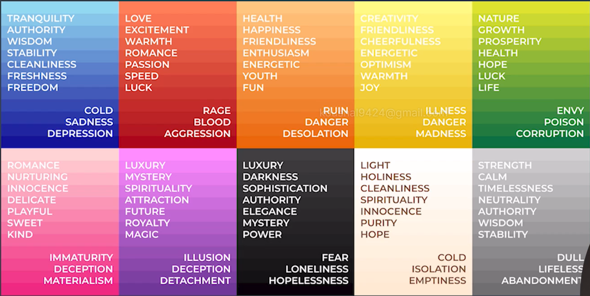

# Reference Websites

## MDN Web Docs

[MDN Web Docs](https://developer.mozilla.org/en-US/) has documentation about HTML, CSS, JS, and more.

## Emmet IO

[Emmet IO](https://docs.emmet.io/abbreviations/syntax/) contains abbreviation techniques for HTML.

## Font Families

<a href="https://www.cssfontstack.com/">Font Families</a> lists all different kinds of fonts.

## Color Palletes

||&emsp;[Coolers](https://coolors.co/) &emsp;||&emsp;[Canva](https://www.canva.com/colors/color-palettes/)&emsp;||&emsp;[Color space](https://mycolor.space/)&emsp;||

## Color Theroy

||&emsp;[Canva Color Wheel](https://www.canva.com/colors/color-wheel/)&emsp;||

## Fonts

||&emsp;[Google Fonts](https://fonts.google.com/)&emsp;||

## Icons

||&emsp;[Google Icons](https://fonts.google.com/icons) : Paste The Link in the head and add the span in your html document &emsp;||

||&emsp;[Font Awesome](https://fontawesome.com/icons) : Go on the icon you want to use and copy it's html code but first add it's library from website named [cdnjs](https://cdnjs.com/libraries/font-awesome) &emsp;||

## How to Make a Readme File

||&emsp;[GitHub Readme](https://docs.github.com/en/repositories/managing-your-repositorys-settings-and-features/customizing-your-repository/about-readmes) &emsp;||
&emsp;[Make a Readme](https://github.com/matiassingers/awesome-readme) &emsp;||
&emsp;[Awesome Readme](https://github.com/matiassingers/awesome-readme) &emsp;||
